# KT2

## Запуск композа
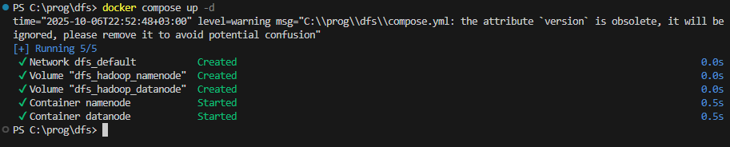

## Подключение к интерактивной сессии терминала в контейнере  
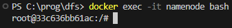

## Создание папки  
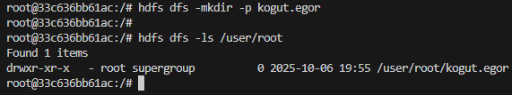

## Локальный файл  
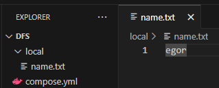

## Директория смонтирована к /mnt в композе  
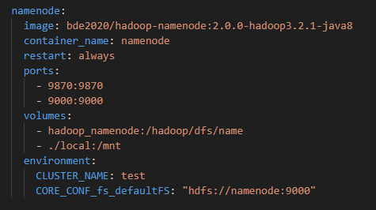

## Файл в подключенной директории внутри контейнера  
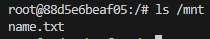

## Сохранение в распределенное хранилище  
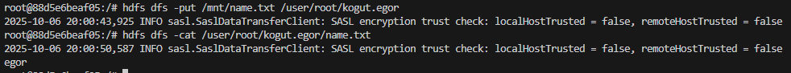

## Получение из распределенного хранилища после удаления  
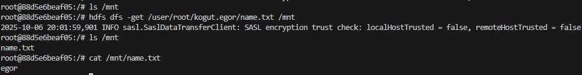

## Файл после получения  
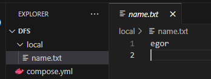

## Второй файл  
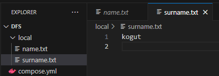

## Кладем второй файл в распределенное хранилище  
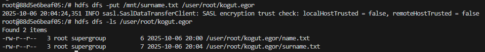

## Соединяем файлы в распределенном хранилище через пайп и выводим содержимое  
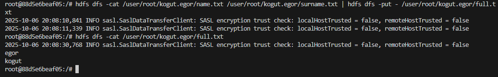

## Изменяем его флаги доступа на read-only  
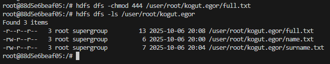
