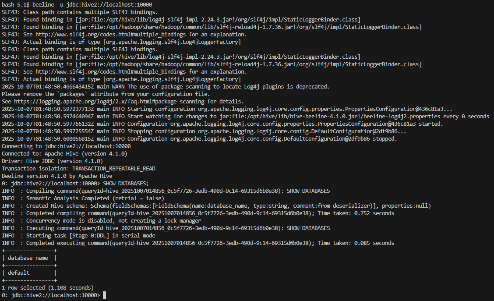
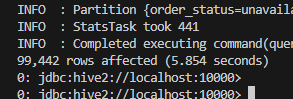

# Описание проделанной работы

Настройка среды

Развернул HDFS и Hive на Docker.

Создал необходимые директории в HDFS и переместил туда CSV-файлы датасета.

Создание базы данных и таблиц

Создана база olist_db.

Созданы внешние таблицы Hive для всех CSV-файлов: orders, order_items, customers, products, sellers, payments, reviews.

Таблицы подключены к данным в HDFS через EXTERNAL TABLE.

Анализ данных с использованием HiveQL

Подсчитано количество заказов по статусам.

Определено среднее время доставки (разница между order_purchase_timestamp и order_delivered_customer_date).

Проведен анализ продаж: топ-5 продуктов по количеству заказов и средний рейтинг по категориям продуктов.

Оптимизация производительности

Таблицы преобразованы в формат Parquet для ускорения чтения.

Добавлено партиционирование по статусу заказа и по датам, что уменьшило объем сканируемых данных и ускорило запросы.

# Отчет

Данные на диске
1

## Данные на диске

## Загрузка на hdfs

## Проверка на hdfs

## Перемещение по папкам

## Hive в compose

## Подключение внутри контейнера и создание бд

## Создание табличек в hive ссылающиеся на hdfs

## Проверка таблички

## Количество заказов в каждом статусе

## Среднее время доставки

## Топ-5 самых продаваемых продуктов по количеству заказов

## Оптимизация производительности

